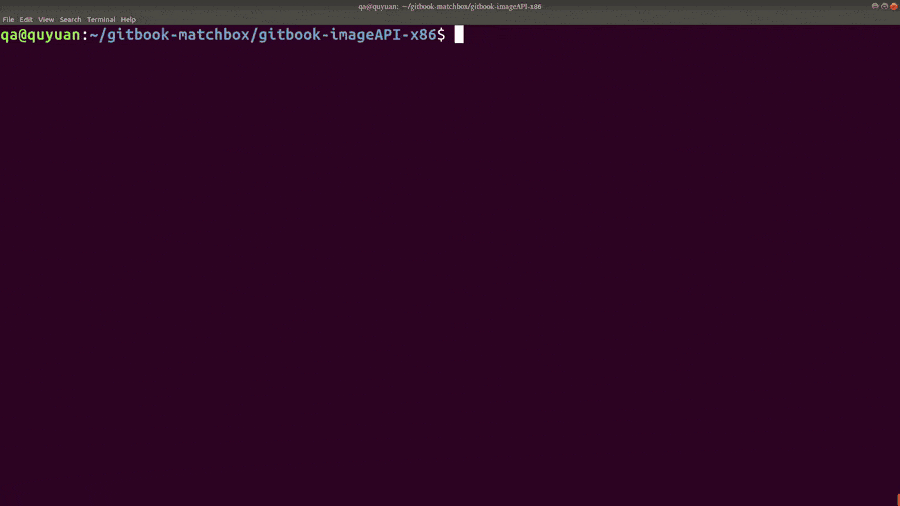

  

<h1 align="center"> Gitbook </h1>

  <b >Build gitbook locally with docker image</b>

 

x86: 

# Manual

# Logistics

### Contributing

Please read [CONTRIBUTING.md](https://github.com/ChineseTeapot/gitbook/blob/master/.github/CONTRIBUTING.md) for contributing.
For details on our [code of conduct](https://github.com/ChineseTeapot/gitbook/blob/master/.github/CODE_OF_CONDUCT.md), and the process for submitting pull requests to us.

### Versioning

We use [SemVer](http://semver.org/) for versioning. For the versions available, see the tags on this repository

### Authors

* **AUTHOR** - *Initial work* - [brownyuan](https://github.com/brownyuan)

See also the list of [contributors](https://github.com/ChineseTeapot/gitbook/graphs/contributors) who participated in this project.

### Acknowledgments

See [Acknowledgments](https://github.com/ChineseTeapot/gitbook/blob/master/.github/ACKNOWLEDGMENTS.md)

### License

This project is licensed under the MIT License - see the [LICENSE.md](https://github.com/ChineseTeapot/gitbook/blob/master/LICENSE.md) file for details
